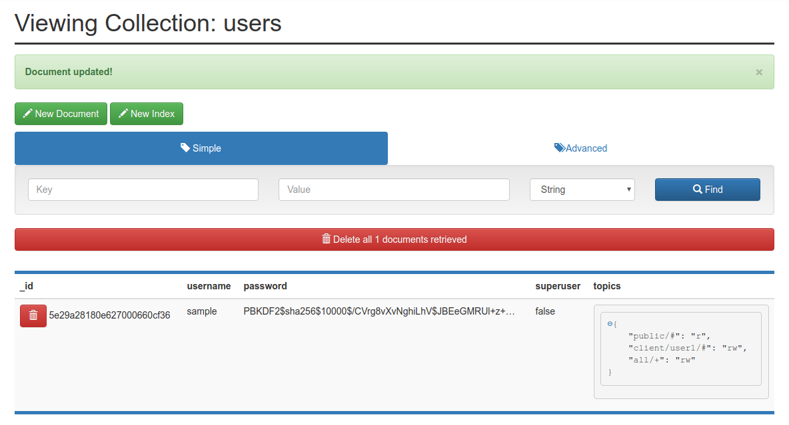

# docker-mosquitto-auth-plugin

This repository contains a Docker file, which creates a mqtt container with the mqtt-auth-plug with a MongoDB configuration.

## Build

The simplest way to build the mqtt container with the auth plugin is to run the docker-compose file.

```bash
docker-compose -f "./docker-compose.yml" up -d --build
```

### Manual

Or build the container manual.

```bash
docker build --rm -f "Dockerfile" -t mosquittoauthplugin:1.6.8 "."

# run it
docker run -it \
-v ./mosquitto.conf:/mosquitto/conf/mosquitto.conf \
--name mqtt-auth \
-p 1883:1883 \
mosquittoauthplugin:1.6.8
```

## MongoDB configuration

The current configuration uses the root user for mongodb, which should only be used for development purposes.

Now you need to create the Collections for the mqtt to use it. [Main Git Repo link](https://github.com/jpmens/mosquitto-auth-plug#mongodb-auth)

### Create only users collection

You create only one collection with the user, password and the allowed topics. This is gonna look like on the picture.


You also need to create the password. Therefore the **contrib** folder on the Main Github repo will help you.

To create the password hash for the user which will be read by the auth-plugin, you have several implementation samples on the main repo.

[Link to main repo](https://github.com/jpmens/mosquitto-auth-plug/tree/master/contrib)

### (Optional) Create new DB user

Create a user for the mqtt plugin on the mqGate Database, since you wan't to use the root user because of security reasons.

Therefore login on the mongo container either with the mongo shell or direct on the docker container, where the mongo shell is also installed.

**Mongo Shell**

To login with the mongo shell, you need to have it installed on your local machine. On the following link, you'll find out how to install it. [Mongo Shell Link](https://docs.mongodb.com/manual/mongo/)

```bash
mongo -u root localhost:27017/admin
```

**Docker Container**

the name "mongo" stands for the container name, which may be different.

```bash
docker exec -it mongo bash

mongo -u root localhost:27017/admin
```

**Mongo Create user**

Now you're on the mongo shell and can use the mongo commands to create a new user for your database.

```bash
show dbs
# this lists all current databases on your mongodb instance.
use mqGate
# use your mqtt db in this case, mqGate.
db.createUser({ 
    user: "mqtt",
    pwd: "yourpasword",
    roles: [{role: "read", db: "mqGate"}]
})
# this Should return: Successfully added user: ....
```

Now you need to change the uri in the mosquitto.conf file with the new generated user credentials.

[Doc Link](https://docs.mongodb.com/manual/reference/method/db.createUser/)